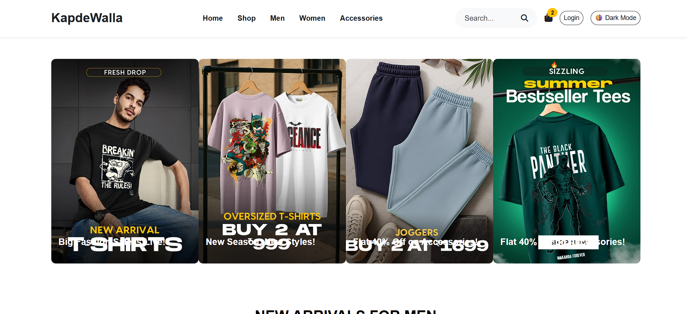

# 👕 KapdeWalla – Static Fashion Website

A modern, responsive static e-commerce homepage built with semantic HTML, custom CSS, and Bootstrap 5. This project showcases a complete fashion storefront layout including promotional campaigns, product showcases, FAQs, and theme toggling.

---

## ✨ Features

- ✅ Semantic HTML5 structure
- ✅ Responsive design using Bootstrap 5
- ✅ Horizontal campaign carousel
- ✅ Product sections for Men, Women, and Accessories
- ✅ Interactive FAQ accordion
- ✅ Light/Dark mode toggle
- ✅ Smooth scroll "Back to Top" button
- ✅ Fully mobile-friendly layout

---

## 📸 Screenshots

> Homepage preview

---

## 🚀 Live Site

🔗 [Visit KapdeWalla on GitHub Pages](https://Pranay3034.github.io/kapdewalla-homepage-enhanced/)

---

## 🛠️ Built With

- 💻 HTML5 (semantic structure)
- 🎨 CSS3 (custom styling + dark mode support)
- 🧱 Bootstrap 5 (responsive layout & components)
- ⚙️ JavaScript (for interactive features)

---

## 📁 Folder Structure
kapdewalla-homepage-enhanced/
│
├── index.html
├── style.css
├── assets/
│ ├── C1.png, 1.1.jpg, a1.png, ...
│ └── screenshot.png
└── README.md

---

## 🙌 Acknowledgements

Made with ❤️ as part of a frontend development task.  
Special thanks to [Bootstrap](https://getbootstrap.com) and [Font Awesome](https://fontawesome.com) for UI components and icons.

---

## 📬 Contact

If you'd like to connect:

- 🔗 [LinkedIn – Pranay Gedam](https://www.linkedin.com/in/pranaygedam)
- 🐙 [GitHub – @Pranay3034](https://github.com/Pranay3034)

---

> ⚡ Feel free to fork this repo, give it a star, or suggest improvements!
